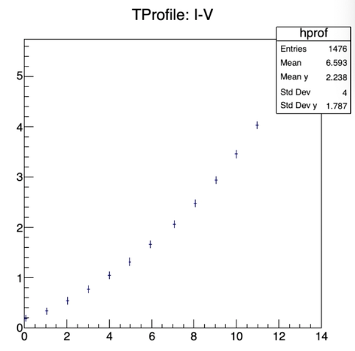

# Histogram


## TH1I/TH1F/TH1D

一维直方图

```c++
TCanvas *c = new TCanvas("c", "c", 800, 1200);
c->Divide(2, 3);

TH1F *f1 = new TH1F("f1", "1D histogram", 50, -10, 10);
float x;
for (int i=0; i<3000; i++){
	x = gRandom->Gaus(0, 0.5);
	f1->Fill(x)
}

c->cd(1);
f1->Draw() // f1->Draw("lego") //lego2
```


## TH2I/TH2F/TH2D

二维直方图

```c++
TH2F *h2 = new TH2F("h2", "2D histogram", 50, -10, 10, 50, -10, 10);
h2->Fill(x, y);
```


## TF1

一维图

```c++
TF1 *f1 = new TF1("f1", "sin(x)/x", -10, 10);
f1->Draw();
```


## TF2

二维图

```c++
TF2 *f2 = new TF2("f2", "1/exp(x*x + 4*y*y)", -10, 10, -10, 10);
f2->Draw();
```


## Draw()

```
f->Draw("colz");
f->Draw("surf");
f->Draw("surf2");
f->Draw("surf3");
f->Draw("surf4");
```


## TProfile



```
TProfile *p1 = new TProfile("p1", "Title", 100, 0, 15, 0, 6);//分割100份
p1->Fill(x, y);
p1->Draw();
```

